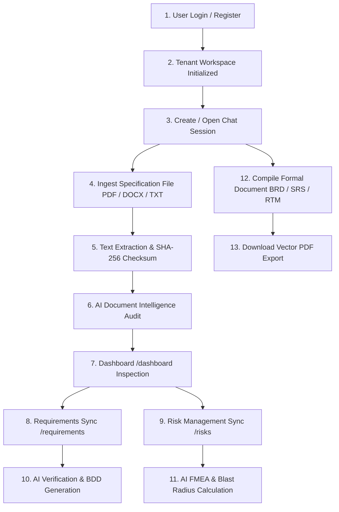

# REFYNE AI: Enterprise Requirement Suite — Complete End-to-End System Guide

---

## 1. Executive Summary & Architecture Overview

**REFYNE AI** is an enterprise-grade AI Requirements Engineering and Specification Platform designed to automate the end-to-end lifecycle of software requirements discovery, document ingestion, risk assessment, quality auditing, formal document generation (BRD, SRS, RTM), and compliance governance.

```
┌───────────────────────────────────────────────────────────────────────────────────────┐
│                                   USER BROWSER (REACT 18 SPA)                         │
│   ┌──────────────┐   ┌──────────────┐   ┌──────────────┐   ┌──────────────────────┐   │
│   │  AI Chat &   │   │  Audit & RTM │   │ Requirements │   │   Risk Management    │   │
│   │ Ingestion UI │   │  Dashboard   │   │  Repository  │   │     & FMEA Matrix    │   │
│   └───────┬──────┘   └──────┬───────┘   └──────┬───────┘   └──────────┬───────────┘   │
└───────────┼─────────────────┼──────────────────┼──────────────────────┼───────────────┘
            │                 │                  │                      │
            ▼                 ▼                  ▼                      ▼
┌───────────────────────────────────────────────────────────────────────────────────────┐
│                               FASTAPI REST BACKEND GATEWAY (:8000)                   │
│   ┌───────────────────────────────────────────────────────────────────────────────┐   │
│   │ TenantIsolationMiddleware & JWT Bearer Authentication (Multi-Tenant Scopes)   │   │
│   └───────────────────────────────────────────────────────────────────────────────┘   │
│   ┌──────────────────────┬────────────────────────┬───────────────────────────────┐   │
│   │  Document Parser     │  Groq AI LLM Engine    │   ReportLab PDF Generator     │   │
│   │  (PyPDF/python-docx) │  (Structured JSON)     │   (Multi-Page Vector Canvas)  │   │
│   └──────────────────────┴────────────────────────┴───────────────────────────────┘   │
└──────────────────────────────────────────┬────────────────────────────────────────────┘
                                           │
                                           ▼
┌───────────────────────────────────────────────────────────────────────────────────────┐
│                           PERSISTENCE & STORAGE LAYER                                 │
│   ┌───────────────────────────────────────┬───────────────────────────────────────┐   │
│   │  PostgreSQL Database (SQLAlchemy/Alembic) │  Persistent Extracted File Storage │   │
│   │  • Users, Tenants, Sessions, Projects  │  • backend/data/extracted/*.txt       │   │
│   │  • Requirements, Risks, Messages, Audits│  • backend/data/audits/*.json         │   │
│   └───────────────────────────────────────┴───────────────────────────────────────┘   │
└───────────────────────────────────────────────────────────────────────────────────────┘
```

---

## 2. Core Technological Architecture

| Layer | Technology | Purpose |
| :--- | :--- | :--- |
| **Frontend UI** | **React 18**, Tailwind CSS, Lucide Icons, Axios | Futuristic Dark Navy / Cyan glassmorphism interface with instant state transitions, responsive drawers, and multi-document filtering. |
| **Backend API** | **Python 3.10+**, **FastAPI**, Pydantic v2 | High-performance asynchronous REST API handling multipart file ingestion, JWT token verification, and tenant isolation. |
| **Persistence** | **PostgreSQL 16**, **SQLAlchemy ORM**, **Alembic** | Multi-tenant schema design with relational foreign keys, cascade safety, and database migrations. |
| **AI Intelligence** | **Groq Cloud API** (`groq/compound-mini`, `openai/gpt-oss-120b`) | Real-time structured JSON extraction, IEEE 830 compliance audits, FMEA risk modeling, and BDD test case generation. |
| **Document Compiler** | **ReportLab Vector Engine** | Generates multi-page corporate PDF documents with running dynamic headers, footers, tables, and corporate styling. |
| **Containerization** | **Docker & Docker Compose** | Multi-container deployment with PostgreSQL health checks, host volume syncing, and hot-reloading. |

---

## 3. End-to-End Workflow & Lifecycle



---

## 4. Comprehensive Page-by-Page & Feature Breakdown

---

### Page 1: Authentication & Workspace Isolation (`/login`, `/register`)

#### 1. What It Does
Provides secure multi-tenant access. Every user belongs to an isolated **Tenant Workspace** where projects, files, requirements, risks, and chat sessions are isolated.

#### 2. User Actions & Inputs
- **Register**: Email, Full Name, Password (minimum 8 characters, letters + numbers), and Workspace Name.
- **Login**: Email & Password.
- **Auto-Session Initialization**: Generates a cryptographically signed HMAC-SHA256 JWT bearer token stored in browser `localStorage`.

#### 3. Behind the Scenes (API & DB)
- **APIs**: `POST /api/v1/auth/register`, `POST /api/v1/auth/login`
- **Database Tables**:
  - `tenants`: Stores workspace UUID, slug, and status (`ACTIVE`).
  - `users`: Stores user identity, Bcrypt-hashed password (12 rounds), role (`ADMIN`, `USER`).
  - `tenant_members`: Links users to their workspace with role permissions.
  - `sessions`: Tracks active token validity and expiration.
- **Security Check**: `TenantIsolationMiddleware` checks every incoming HTTP header for `tenant_id` validation.

---

### Page 2: Conversational AI Requirements Assistant (`/chat`)

#### 1. Visual Layout
- **Left Sidebar**: Chat session history with Rename (`✏️`) and Delete (`🗑️`) controls, active session badge, and `+ New Chat` button.
- **Main Chat Area**: Interactive message stream with Markdown formatting, bot typing animations, prompt recommendations, and document download cards.
- **Top Action Bar**: One-click specification generator buttons: `📋 Generate BRD`, `📄 Generate SRS`, `📊 Generate RTM`.
- **Right Sidebar**:
  - **Quick AI Actions**: Shortcuts for drafting user stories, auditing compliance risks, and building RTM matrices.
  - **Document Intelligence Card**: Direct link to the `/dashboard` quality audit.
  - **Uploaded Files List**: Displays attached documents with file size, extraction status, and **"Audit Document →"** direct action links.
  - **Generated Documents List**: Displays compiled BRD/SRS documents with **"Download PDF"** buttons.

#### 2. What It Does & How It Works
- **File Upload (`📎` button)**:
  1. Accepts `.pdf`, `.docx`, `.txt`, `.json`, `.csv`, `.md`.
  2. Uploads via multipart request `POST /api/v1/files/upload`.
  3. `extract_text_from_file` uses `PyPDF` / `python-docx` to extract plain text.
  4. Saves text to disk (`backend/data/extracted/{file_id}.txt`) and records file entry in PostgreSQL.
  5. Injects file summary into the active chat conversation.
- **AI Conversational Reasoning**:
  - Asks questions to discover missing requirements, non-functional requirements (NFRs), and architectural constraints.
  - User can ask: *"Analyze this PRD and generate user stories with acceptance criteria"* or *"What security gaps exist in this specification?"*
- **Document Generation**:
  - Clicking `Generate BRD`, `Generate SRS`, or `Generate RTM` triggers `POST /api/v1/documents/generate`.
  - Compiles structured sections and tables tailored to the uploaded document context.
  - Renders a document card directly in the chat with a **"Download PDF"** action.

#### 3. Output Produced
- Interactive conversational specification answers.
- Ingested plain-text context files.
- Compiled formal specifications (BRD, SRS, RTM) ready for vector PDF export.

---

### Page 3: Document Intelligence & Quality Audit Dashboard (`/dashboard`)

#### 1. Visual Layout
- **Header**: Document Readiness Meter, Quick action buttons (`💬 Back to Chat`, `⚡ Re-Audit with AI`).
- **Active Document Selector**: Dropdown showing all uploaded files in the workspace with file size, MIME type, and extraction status.
- **Executive Metric Ribbon**:
  - **Document Readiness (%)**: Gauge indicating whether the specification is production-ready, good, or needs expansion.
  - **Clarity & Precision (%)**: Measures ambiguity and terminology precision.
  - **Completeness (%)**: Checks functional and NFR scope coverage.
  - **Security & SAIF (%)**: Evaluates OWASP controls, authentication, and data privacy.
  - **RTM Traceability (%)**: Checks test cases and component mappings.
- **AI Executive Summary Banner**: Cites specific architecture and workflows found in the document.
- **Tabbed Audit Views**:
  1. `🔍 Full Analysis Overview`: Consolidated view of risks, conflicts, missing sections, and recommendations.
  2. `🛡️ Risk Factors`: Document-specific security, architectural, and data privacy failure modes.
  3. `⚡ Conflicts & Ambiguities`: Highlights vague clauses and conflicting statements with suggested resolutions.
  4. `🧩 Missing Sections & Gaps`: Identifies missing NFRs, SLA benchmarks, or disaster recovery policies.
  5. `📊 RTM Matrix`: Tabular matrix mapping business requirements to technical subsystems, test cases, and coverage status (`COVERED`, `PARTIAL`, `GAP`).

#### 2. How the Real-Time AI Extraction Works
- **Multi-Document Selector**: Selecting a document from the dropdown immediately loads that document's specific audit.
- **Behind the Scenes**:
  - `POST /api/v1/documents/audit` sends the document's extracted text to Groq Cloud LLM (`groq/compound-mini` / `openai/gpt-oss-120b`).
  - Prompts the LLM to inspect the actual words, modules, and constraints in the document text.
  - Returns a strict JSON payload with readiness scores, extracted risk items, and RTM table rows.
  - Saves the audit JSON to disk (`backend/data/audits/{file_id}.json`) for persistence.

#### 3. Output Produced
- Live document quality scores (0-100%).
- Real extracted risk factors, ambiguity resolutions, missing gaps, and RTM table.

---

### Page 4: Requirements Repository (`/requirements`)

#### 1. Visual Layout
- **Metrics Ribbon**: Total Requirements count, Validated count, In Review count, Critical Priority count.
- **Filter & Search Bar**: Real-time search query, Type filter (`FUNCTIONAL`, `TECHNICAL`, `SECURITY`, `INTEGRATION`, `BUSINESS`), Status filter (`VALIDATED`, `APPROVED`, `IN_REVIEW`, `DRAFT`, `REJECTED`), and Priority filter.
- **Requirements Grid**: Cards displaying requirement key (e.g. `REQ-001`), title, description, priority badge, and SRS source traceability tag.
- **Actions**:
  - `+ Add Requirement`: Opens specification creation modal.
  - `Edit (✏️)` / `Delete (🗑️)`: Full CRUD management.
- **Right Verification Drawer**:
  - Full title, description, and SRS traceability reference.
  - Quick Status Switcher buttons (`VALIDATED`, `APPROVED`, `IN_REVIEW`, `DRAFT`, `REJECTED`).
  - **"Run AI Audit" Button**: Performs live IEEE 830 / ISO 29148 specification audit.

#### 2. What the AI Verification Engine Generates
When clicking **"Run AI Audit"** (`POST /api/v1/requirements/{id}/verify-ai`), the AI returns:
- **Quality Score (0-100)**: Objective score of requirement clarity and rigor.
- **Testability Status**: `TESTABLE`, `DIFFICULT_TO_TEST`, or `UNTESTABLE`.
- **Ambiguity Warnings**: Flags vague terms (e.g., *"fast"*, *"secure"*, *"user-friendly"* without numerical bounds).
- **Edge Cases**: Specific corner cases (e.g., concurrent tenant updates, network partition, malformed tokens).
- **Security Considerations**: Tenant isolation checks (BOLA/IDOR prevention, cryptographic signature checks).
- **Automated Gherkin BDD Acceptance Criteria**: Formats executable `Given... When... Then...` user stories for QA automation.

#### 3. Output Produced
- Persistent PostgreSQL requirement records.
- Bidirectional traceability links to source documents.
- IEEE 830 verification reports with automated BDD test criteria.

---

### Page 5: Risk Management & Analysis Matrix (`/risks`)

#### 1. Visual Layout
- **Analytics Ribbon**: Total Risks count, Critical/High Impact count, Open Risks count, Mitigated count.
- **Search & Multi-Filter Bar**: Search by title/description, Impact filter (`CRITICAL`, `HIGH`, `MEDIUM`, `LOW`), Likelihood filter, Status filter (`OPEN`, `IN_REVIEW`, `MITIGATED`, `ACCEPTED`, `CLOSED`), and Category filter (`SECURITY`, `TECHNICAL`, `COMPLIANCE`, `OPERATIONAL`, `DATA_PRIVACY`).
- **Risk Cards**: Dark cards displaying risk key (e.g. `RSK-101`), title, associated project, status badge, impact tag, likelihood tag, and calculated severity score percentage ($Impact \times Likelihood$).
- **`+ Log New Risk` Modal**:
  - Form fields: Title, Category, Impact, Likelihood, Status, Description, Mitigation Strategy, Contingency Plan.
  - **"⚡ AI Auto-Suggest Mitigation" Button**: Calls `POST /api/v1/risks/suggest-mitigation-ai` to automatically draft prevention controls and emergency rollback plans based on the risk title.
- **Right Risk Detail & FMEA Drawer**:
  - Full risk overview and severity score meter.
  - Status quick-switcher.
  - Mitigation Strategy and Contingency Rollback Plan.
  - **"Run AI Audit" Button**: Triggers Failure Mode & Effects Analysis (FMEA).

#### 2. What the AI FMEA Risk Engine Generates
When clicking **"Run AI Audit"** (`POST /api/v1/risks/{id}/assess-ai`), the AI returns:
- **Failure Modes**: Root cause scenarios and cascading failure vectors.
- **Blast Radius Calculation**: Scopes failure impact (`ISOLATED_SERVICE`, `TENANT_WIDE`, or `SYSTEM_WIDE`).
- **Residual Risk Level**: Expected risk rating post-mitigation (`LOW`, `MEDIUM`).
- **Preventative Engineering Steps**: Actionable technical steps to eliminate root causes.
- **Immediate Contingency Plan**: Emergency incident response actions.
- **Regulatory Compliance Impact**: Details potential violations against **SOC2 Type II, ISO 27001, GDPR, and HIPAA**.

#### 3. Output Produced
- Persistent risk records in PostgreSQL `risks` table.
- Calculated severity scores and FMEA audit reports.

---

### Page 6: Formal Document Engine & Multi-Page Vector PDF Export (`/documents`)

#### 1. Document Types Supported
1. **BRD (Business Requirements Document)**:
   - Executive Summary, Strategic Vision, Scope & Boundaries, Stakeholder Personas.
   - Business Requirements Matrix (BR-101 to BR-xxx).
   - Business Rules, Assumptions, and Sign-Off Criteria.
2. **SRS (Software Requirements Specification)**:
   - System Architecture, Subsystems, Decoupled Component Hierarchy.
   - Functional Specifications Matrix (SRS-201 to SRS-xxx).
   - Non-Functional Requirements (NFR) for latency (<200ms), throughput, and uptime (99.9%).
   - RBAC Permissions Matrix, External REST API catalog, Error Resilience Protocols.
3. **RTM (Requirements Traceability Matrix)**:
   - Bidirectional mapping table: `BRD ID` ↔ `Business Goal` ↔ `SRS ID` ↔ `Technical Component` ↔ `Test Case ID` ↔ `Risk ID` ↔ `Verification Status`.
   - Coverage percentage metric (100% target).
4. **RISK_ASSESSMENT (Threat Modeling & Risk Audit)**:
   - Security Overview, OWASP Threat Matrix (RSK-401 to RSK-xxx).
   - Data Privacy Audit (GDPR, SOC2) and recommended technical action items.

#### 2. ReportLab PDF Vector Compilation Engine
- Built using `reportlab.platypus` with custom corporate styling:
  - **Two-Pass `NumberedCanvas`**: Dynamically calculates and stamps `"Page X of Y"` footers and running headers on all pages.
  - **Flowable Tables**: Auto-wrapping table columns with dark headers, zebra stripes, and colored status badges (`APPROVED`, `VERIFIED`, `MITIGATED`).
  - **Typography**: Clean Helvetica hierarchy with custom paragraph spacing and corporate divider rules.
- **API Endpoint**: `GET /api/v1/documents/{id}/export/pdf?title=...&type=...` returns binary `application/pdf` download stream.

---

## 5. Database Schema & Data Models

```
               ┌────────────────┐
               │    tenants     │
               └───────┬────────┘
                       │ 1:N
        ┌──────────────┼──────────────┬──────────────┐
        ▼              ▼              ▼              ▼
 ┌─────────────┐ ┌─────────────┐ ┌─────────────┐ ┌─────────────┐
 │    users    │ │  projects   │ │    files    │ │    risks    │
 └──────┬──────┘ └──────┬──────┘ └─────────────┘ └─────────────┘
        │ 1:N           │ 1:N
        ▼               ▼
 ┌─────────────┐ ┌─────────────┐
 │  sessions   │ │requirements │
 └─────────────┘ └──────┬──────┘
                        │ 1:N
                        ▼
                 ┌─────────────┐
                 │req_links    │
                 └─────────────┘
```

### Table Definitions

| Table | Key Columns | Description |
| :--- | :--- | :--- |
| `tenants` | `id` (UUID), `name`, `slug`, `status`, `created_at` | Enterprise tenant organization scope. |
| `users` | `id` (UUID), `email`, `password_hash`, `name`, `status`, `created_at` | User accounts with hashed credentials. |
| `sessions` | `id` (UUID), `tenant_id`, `user_id`, `expires_at`, `revoked_at` | Active authentication bearer tokens. |
| `projects` | `id` (UUID), `tenant_id`, `name`, `description`, `created_by` | Project workspaces within a tenant. |
| `conversations`| `id` (UUID), `tenant_id`, `project_id`, `title`, `created_at` | Chat sessions for requirements discovery. |
| `messages` | `id` (UUID), `conversation_id`, `role`, `content`, `metadata_json` | Chat history and generated document cards. |
| `files` | `id` (UUID), `tenant_id`, `name`, `mime_type`, `size_bytes`, `storage_key` | Uploaded specification documents. |
| `requirements` | `id` (UUID), `tenant_id`, `project_id`, `requirement_key`, `title`, `description`, `type`, `status`, `source_location` | Core functional and technical specifications. |
| `risks` | `id` (UUID), `tenant_id`, `project_id`, `risk_key`, `title`, `description`, `impact`, `likelihood`, `status`, `category`, `mitigation_strategy`, `severity_score` | Enterprise failure modes and mitigation tracking. |
| `audit_events` | `id` (UUID), `tenant_id`, `actor_id`, `event_type`, `resource_id`, `created_at` | Immutable compliance and governance audit trail. |

---

## 6. AI Engine & Prompts Architecture

### 1. Document Intelligence (`analyze_document_intelligence`)
- **Models**: `groq/compound-mini` (fallback: `openai/gpt-oss-120b`, `qwen/qwen3.8-27b`)
- **System Prompt**: Evaluates document text against IEEE 830, ISO 29148, SAIF, and OWASP standards.
- **Output**: Returns JSON with readiness score, clarity score, completeness score, security score, RTM score, executive summary, risk factors, ambiguities, missing gaps, and RTM table rows.

### 2. Requirement Verification (`verify_requirement_ai`)
- **Purpose**: Audits requirement testability and generates automated acceptance criteria.
- **Output**: Returns JSON with quality score, testability rating (`TESTABLE`, `UNTESTABLE`), ambiguity notes, edge cases, security checks, and Gherkin BDD user stories (`Given... When... Then...`).

### 3. Risk Assessment & FMEA (`analyze_risk_ai`)
- **Purpose**: Performs Failure Mode & Effects Analysis on project risks.
- **Output**: Returns JSON with blast radius (`ISOLATED_SERVICE`, `TENANT_WIDE`, `SYSTEM_WIDE`), failure modes, mitigation steps, emergency contingency plan, monitoring alerts, and compliance impact (SOC2, ISO 27001, GDPR).

### 4. Mitigation Auto-Suggest (`suggest_mitigation_ai`)
- **Purpose**: Live auto-complete helper during risk creation.
- **Output**: Returns concrete architectural controls and contingency rollback plans tailored to the risk title.

---

## 7. How to Run the Project

### Option A: Running with Docker (Recommended)

1. Ensure Docker Desktop is running.
2. From the project root directory, run:
   ```bash
   docker compose up --build
   ```
3. Services will start automatically:
   - **Frontend UI**: `http://localhost:3000`
   - **Backend API**: `http://localhost:8000`
   - **API Docs (Swagger)**: `http://localhost:8000/docs`
   - **PostgreSQL Database**: `localhost:5432`

> [!TIP]
> `docker-compose.yml` mounts local folders (`./backend:/app` and `./frontend/src:/app/src`) with polling enabled, so code edits sync and hot-reload immediately inside the running containers.

---

### Option B: Running Locally without Docker

#### 1. Start PostgreSQL Database
Ensure PostgreSQL is running locally on port 5432 with database `refyne`.

#### 2. Start Backend Server
```bash
cd backend
python -m venv .venv
.venv\Scripts\activate
pip install -r requirements.txt
alembic upgrade head
python -m uvicorn refyne.main:app --host 0.0.0.0 --port 8000 --reload
```

#### 3. Start Frontend Development Server
```bash
cd frontend
npm install
npm start
```
Frontend will launch in your browser at `http://localhost:3000`.

---

## 8. Summary of Capabilities

| Capability | Status | Description |
| :--- | :--- | :--- |
| **Multi-Tenant Authentication** | Verified | JWT Bearer authentication with tenant workspace isolation and Bcrypt hashing. |
| **Document Ingestion & Text Extraction** | Verified | Parses PDF, DOCX, and text files, storing persistent text on disk and in database. |
| **AI Document Intelligence Dashboard** | Verified | Multi-document selector providing genuine, file-specific readiness scores, risks, and RTM matrices. |
| **Requirements Repository** | Verified | Full CRUD with IEEE 830 / ISO 29148 AI verification and Gherkin BDD test criteria generation. |
| **Risk Management & FMEA Matrix** | Verified | Full CRUD with $Impact \times Likelihood$ severity scoring, AI auto-suggest mitigation, and blast radius scoping. |
| **Formal Document Engine** | Verified | Compiles structured BRD, SRS, and RTM specifications with multi-page vector PDF export. |
| **Audit Trail & Governance** | Verified | Captures immutable audit log entries for all authentication, file upload, document generation, and export events. |

---
*REFYNE AI — Enterprise Requirements Engineering, Compliance & Risk Intelligence Platform.*
